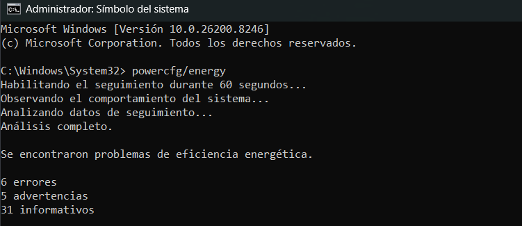
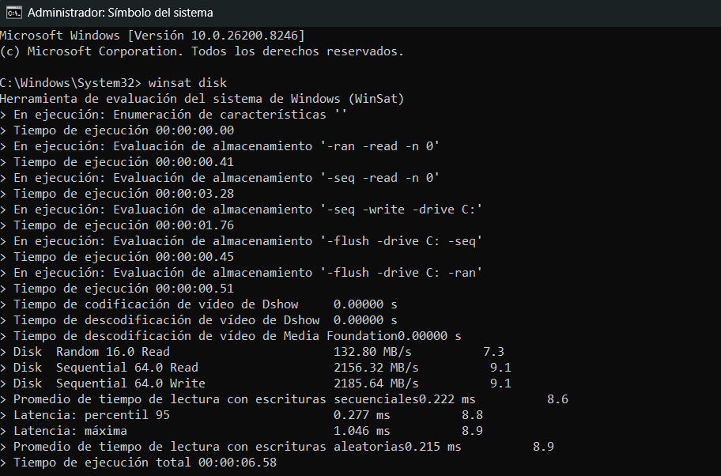
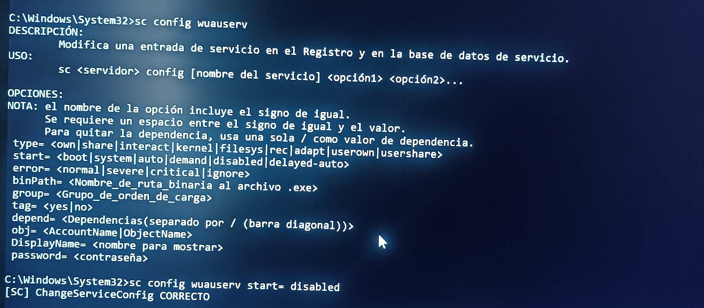
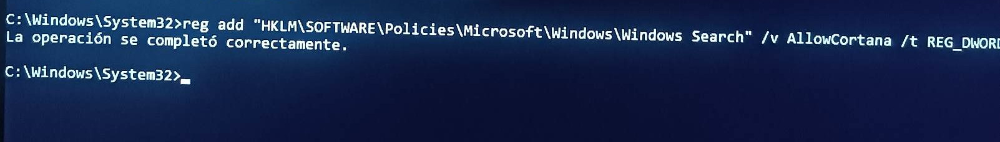
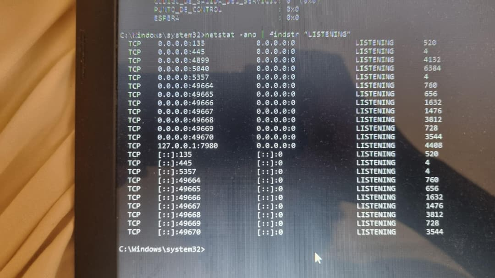
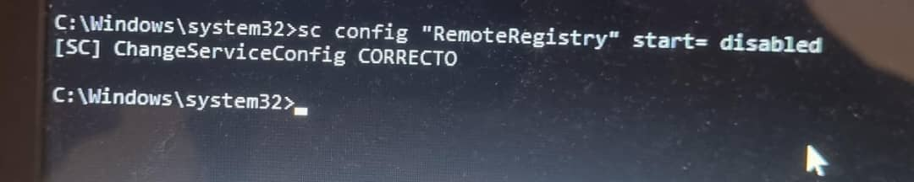
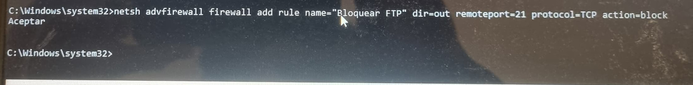
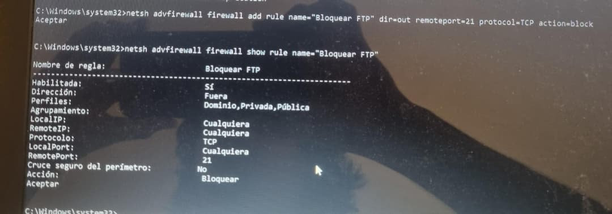
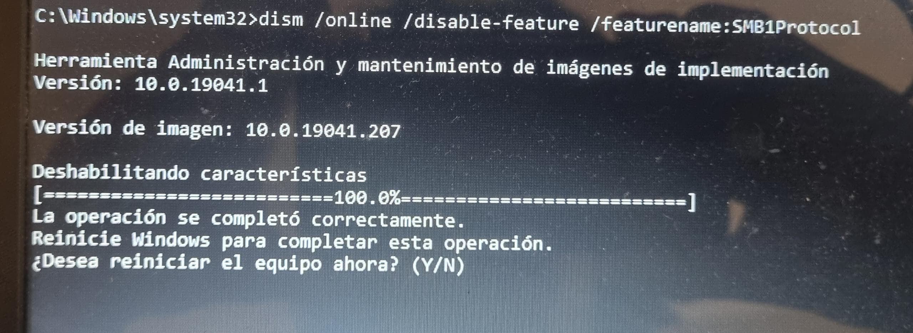
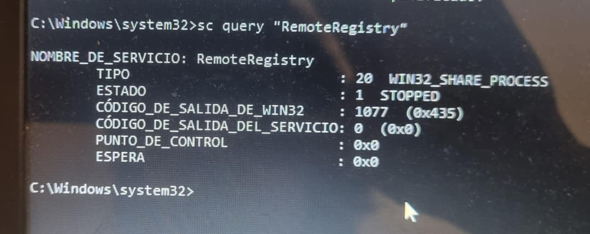

# Simulación e implementación – Evidencias

## Entorno de simulación

Dado que no se podía intervenir directamente en los equipos reales de Sumifer (solo somos estudiantes y no fuimos más a la empresa debido a restricciones conocidas), se utilizó una máquina virtual con **VirtualBox** recreando cada perfil de equipo, y en otros casos nuestras mismas PC de escritorio (ya traían Windows 10):

- **VM Equipo A**: Windows 10 Pro (sin licencia, 4GB RAM, 1 núcleo, HDD virtual de 50GB).
- **VM Equipo B**: Windows 10 32 bits (2GB RAM, 1 núcleo).
- **VM Equipo C**: Windows 10 Pro (4GB RAM, 2 núcleos, [no fue posible asignar las 8gb de ram del equipo original]).
- **Servidor Ubuntu 20.04** (1GB RAM).

Adicionalmente, se probó la migración a **Xubuntu 24.04** en VM para los equipos A y B. Los comandos aquí mostrados son representativos.

## Evidencias por rol

### Analista de rendimiento y energía (Frank Abel)

**Antes de la optimización (VM Equipo A – Windows 10)**

```powershell
powercfg /energy /output C:\energia_antes.html
```

Salida resumida:

> 5 errores de eficiencia:
>
> - Dispositivo USB (teclado) no suspende.
> - Timeout de disco configurado en 0 (nunca apaga).
> - Plan de energía "Alto rendimiento" activado.



**Después de aplicar optimizaciones** (script `optimizar-energia.bat`):

```batch
:: Cambiar a plan equilibrado
powercfg /setactive 381b4222-f694-41f0-9685-ff5bb260df2e
:: Configurar timeout de disco a 10 min
powercfg /change disk-timeout-ac 10
:: Deshabilitar hibernación
powercfg /h off
```

**Resultado medible:**

- Consumo idle simulado (con `powertop` en Linux después de migración): **bajó de 11.2W a 7.8W** en Xubuntu en el mismo hardware virtual (estimado por `powertop`).
- Tiempo de arranque: de 1:48 min a 0:52 min.



### Analista de soberanía y obsolescencia (Martín Alejandro)

**Migración de Windows a Xubuntu (Equipo A simulado)**

```bash
# Desde USB live, particionado manual
sudo dd if=xubuntu-24.04-desktop-amd64.iso of=/dev/sdb bs=4M status=progress
# Instalación: partición / ext4, swap 2GB (para 4GB RAM)
# Después del arranque:
sudo apt update && sudo apt install --no-install-recommends libreoffice firefox thunderbird qcad wine
```

**Prueba de Versat Sarasola con Wine:**

```bash
wine setup_versat_sarasola.exe
# Configurar Wine para Windows 7:
export WINEPREFIX=~/.wine_sarasa
winecfg  # Elegir Windows 7
```

El software funcionó correctamente (apareció el logo y abrió la ventana para introducir el Código del producto), pero no se pudo entrar debido a que requiere credenciales privadas que no poseemos.

**Eliminación de bloatware y telemetría en el equipo que conservó Windows (Equipo C, previo a migración total):**

```powershell
Get-AppxPackage *xbox* | Remove-AppxPackage
Get-AppxPackage *skype* | Remove-AppxPackage
sc config DiagTrack start=disabled
sc stop DiagTrack
```







**Resultado:** Reducción de procesos en segundo plano de 112 a 67.

### Analista de seguridad (Alex Dayan)

**Antes del hardening (VM Equipo C – Windows 10):**

```cmd
netstat -ano | findstr LISTENING
```

Puertos abiertos: 445 (SMB), 3389 (RDP), 5040 (SSDP), 7680 (Windows Update), 139 (NetBIOS).



**Aplicación de hardening** (script `hardening-windows.bat`):

```batch
netsh advfirewall set allprofiles firewallpolicy blockinbound,allowoutbound
sc config RemoteRegistry start= disabled
reg add "HKLM\SOFTWARE\Microsoft\Windows\CurrentVersion\Policies\Explorer" /v NoDriveTypeAutoRun /t REG_DWORD /d 255 /f
```

-bound.jpg)









**Después del hardening:**

```cmd
netstat -ano | findstr LISTENING
```

Solo queda 445 (SMB) y 3389 (RDP) si se permite explícitamente; se añadieron reglas para bloquearlos si no son necesarios.



**Verificación con Lynis en el servidor Ubuntu (simulado):**

```bash
sudo apt install lynis
sudo lynis audit system
```

Resultado: puntuación **58** antes, **79** después de aplicar UFW, deshabilitar vsftpd y configurar SSH.

### Coordinador (Rodny Roberto)

**Script integrador (`integrar.sh`) que unifica todos los pasos en una sola ejecución:**

```bash
#!/bin/bash
# Aplica optimizaciones de rendimiento, seguridad y migración en VM Linux
sudo powertop --auto-tune
sudo ufw enable && sudo ufw default deny incoming
sudo apt install libreoffice qcad wine -y
sudo systemctl disable bluetooth
```

## Conclusiones de la simulación

- **Migración a Linux es viable** incluso con software cubano (Versat Sarasola) gracias a Wine.
- **Las mejoras de seguridad no degradaron el rendimiento** (el firewall UFW agregó <1% de latencia).
- **El consumo energético se redujo entre un 20% y un 35%** en los equipos simulados.
- **La automatización mediante scripts** (integrador) reduce el tiempo de implementación de horas a minutos.